# rocketMq
消息队列rocketmq的学习

# 基本概念

  1. message消息：消息是指系统所传输信息的物理载体,每条消息必须属于一个主题topic

  2. 主题（Topic）： Topic指一系列消息的集合，每个主题包含多个消息，一个消息只能属于一个主题
  一个生产者可以生产多个主题的消息,而一个消费者只可以订阅消费一个主题的消息

  3. 标签（Tag）：为消息所射上的标签，用于同一主题下区分不同类型的消息。来自同一业务单元的消息，可以根据不同业
     务目的在同一主题下设置不同标签。Topic是消息的一级分类，Tag是消息的二级分类

  4. 队列（Queue）：存储消息的物理实体，一个Topic中可以有多个队列，每个Queue中存放的是Topic中的消息，一
     个Topic的Queue也被称为一个Topic中消息的分区（Partition）。一个Topic的queue中的消息只能呗一个消费者组中的
     一个消费者所消费，一个Queue中的消息不允许同一个消费者组中的多个消费者同时消费。

  5. 分片：是指一个Broker在一个Topic中的Queue的集合，存放相应Topic的Broker。每个分片中会创建出相应数量的分区，即Queue，每个
     Queue的大小都是相同的。

  6. 消息标识（MessageId/Key）：RocketMQ中每个消息拥有唯一的MessageId，且可以携带具有业务标识的Key，以方便对消息的查询。
     不过需要注意的是，MessageId有两个：在生产者send()消息时会自动生成一个MessageId（msgId)，
     当消息到达Broker后，Broker也会自动生成一个MessageId(offsetMsgId)。msgId、offsetMsgId与key都
     称为消息标识。
     msgId：由producer端生成，其生成规则为：
     producerIp + 进程pid + MessageClientIDSetter类的ClassLoader的hashCode +
     当前时间 + AutomicInteger自增计数器
     offsetMsgId：由broker端生成，其生成规则为：brokerIp + 物理分区的offset（Queue中的
     偏移量）
     key：由用户指定的业务相关的唯一标识

#  系统架构  
    

  1. Producer：消息生产者，负责生产消息。Producer通过MQ的负载均衡模块选择相应的Broker集群队列进行消息投
     递，投递的过程支持快速失败并且低延迟。
     例如，业务系统产生的日志写入到MQ的过程，就是消息生产的过程
     再如，电商平台中用户提交的秒杀请求写入到MQ的过程，就是消息生产的过程
     RocketMQ中的消息生产者都是以生产者组（Producer Group）的形式出现的。生产者组是同一类生产
     者的集合，这类Producer发送相同Topic类型的消息。一个生产者组可以同时发送多个主题的消息。

  2. Consumer: 消息消费者，负责消费消息。一个消息消费者会从Broker服务器中获取到消息，并对消息进行相关业务
     处理。
     RocketMq中的消费者是以消费者组的形式存在的，一个消费者组中的消费者消费同一类型（Topic）的消息，消费者组实现了'负载均衡'，
     是针对消费者做负载均衡，将一个Topic中的Queue平均分配给消费者组中的不同的消费者，实现了高容错当一个消费者挂掉后会由其他的消费者接着原Consumer
     所消费的Queue去接着消费。
     
     消费者组中Consumer的数量应该小于等于订阅Topic的Queue数量。如果超出Queue数量，则多出的
     Consumer将不能消费消息。 
     
     不过，一个Topic类型的消息可以被多个消费者组同时消费。
     注意，
     1）消费者组只能消费一个Topic的消息，不能同时消费多个Topic消息
     2）一个消费者组中的消费者必须订阅完全相同的Topic

  3.  Name Server：是一个Broker与Topic路由的注册中心，支持Broker的动态注册与发现
      主要包括两个功能：

               1.Broker的管理：接受Broker集群的注册信息并且保存下来作为路由信息的基本数据；提供心跳检测机制，检查Broker是否还存活

               2. 路由信息管理：每个NameServer中都保存着Broker集群的整个路由信息和用于客户端查询的队列信息。
                    Producer和Conumser通过NameServer可以获取整个Broker集群的路由信息，从而进行消息的投递和消费。

               3. 路由注册
                     NameServer通常也是以集群的方式部署，不过，NameServer是无状态的，即NameServer集群中的各
                     个节点间是无差异的，各节点间相互不进行信息通讯。那各节点中的数据是如何进行数据同步的呢？在
                     Broker节点启动时，轮询NameServer列表，与每个NameServer节点建立长连接，发起注册请求。在
                     NameServer内部维护着⼀个Broker列表，用来动态存储Broker的信息。
                     注意，这是与其它像zk、Eureka、Nacos等注册中心不同的地方。
                     这种NameServer的无状态方式，有什么优缺点：
                     优点：NameServer集群搭建简单，扩容简单。
                     缺点：对于Broker，必须明确指出所有NameServer地址。否则未指出的将不会去注册。也正因
                     为如此，NameServer并不能随便扩容。因为，若Broker不重新配置，新增的NameServer对于
                     Broker来说是不可见的，其不会向这个NameServer进行注册
                      Broker节点为了证明自己是活着的，为了维护与NameServer间的长连接，会将最新的信息以心跳包的
                      方式上报给NameServer，每30秒发送一次心跳。心跳包中包含 BrokerId、Broker地址(IP+Port)、
                      Broker名称、Broker所属集群名称等等。NameServer在接收到心跳包后，会更新心跳时间戳，记录这
                      个Broker的最新存活时间。

               4. 路由剔除：由于Broker关机、宕机或网络抖动等原因，NameServer没有收到Broker的心跳，NameServer可能会将
                      其从Broker列表中剔除。
                      NameServer中有⼀个定时任务，每隔10秒就会扫描⼀次Broker表，查看每一个Broker的最新心跳时间
                      戳距离当前时间是否超过120秒，如果超过，则会判定Broker失效，然后将其从Broker列表中剔除。

                      扩展：对于RocketMQ日常运维工作，例如Broker升级，需要停掉Broker的工作。OP需要怎么
                      做？
                      OP需要将Broker的读写权限禁掉。一旦client(Consumer或Producer)向broker发送请求，都会收
                      到broker的NO_PERMISSION响应，然后client会进行对其它Broker的重试。
                      当OP观察到这个Broker没有流量后，再关闭它，实现Broker从NameServer的移除。
                      OP：运维工程师
                      SRE：Site Reliability Engineer，现场可靠性工程师
               

               5. 路由发现： RocketMQ的路由发现采用的是Pull模型。当Topic路由信息出现变化时，NameServer不会主动推送给
                            客户端，而是客户端定时拉取主题最新的路由。默认客户端每30秒会拉取一次最新的路由。

                    扩展：
                    1）Push模型：推送模型。其实时性较好，是一个“发布-订阅”模型，需要维护一个长连接。而
                    长连接的维护是需要资源成本的。该模型适合于的场景：
                    实时性要求较高
                    Client数量不多，Server数据变化较频繁
                    2）Pull模型：拉取模型。存在的问题是，实时性较差。
                    3）Long Polling模型：长轮询模型。其是对Push与Pull模型的整合，充分利用了这两种模型的优
                    势，屏蔽了它们的劣势。

               6. 客户端NameServer选择策略:
                    这里的客户端指的是Producer与Consumer
                    客户端在配置时必须要写上NameServer集群的地址，那么客户端到底连接的是哪个NameServer节点
                    呢？客户端首先会生产一个随机数，然后再与NameServer节点数量取模，此时得到的就是所要连接的
                    节点索引，然后就会进行连接。如果连接失败，则会采用round-robin策略，逐个尝试着去连接其它节
                    点。
                    首先采用的是随机策略进行的选择，失败后采用的是轮询策略。

  4.  Broker: 负责消息的存储与转发工作，接受来自于Consumer的消息，并且时刻为消费者消费消息做准备，存储着消息的一些元数据包括包括
        消费者组消费进度偏移offset、主题、队列等。
            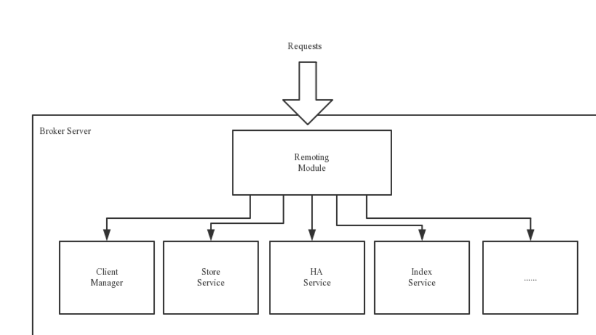

          Remoting Module：整个Broker的实体，负责处理来自clients端的请求。而这个Broker实体则由以下模
          块构成。

          Client Manager：客户端管理器。负责接收、解析客户端(Producer/Consumer)请求，管理客户端。例
          如，维护Consumer的Topic订阅信息

          Store Service：存储服务。提供方便简单的API接口，处理消息存储到物理硬盘和消息查询功能。

          HA Service：高可用服务，提供Master Broker 和 Slave Broker之间的数据同步功能。

          Index Service：索引服务。根据特定的Message key，对投递到Broker的消息进行索引服务，同时也提
          供根据Message Key对消息进行快速查询的功能。

        集群部署：

  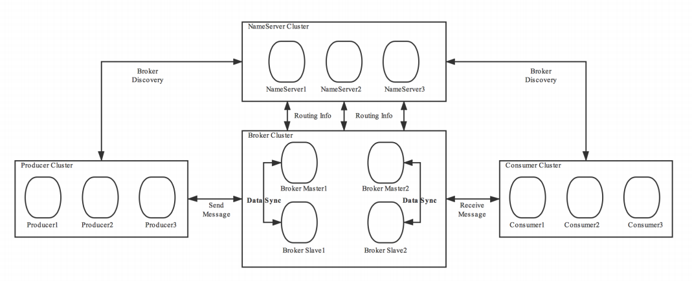

          为了增强Broker性能与吞吐量，Broker一般都是以集群形式出现的。各集群节点中可能存放着相同
          Topic的不同Queue。不过，这里有个问题，如果某Broker节点宕机，如何保证数据不丢失呢？其解决
          方案是，将每个Broker集群节点进行横向扩展，即将Broker节点再建为一个HA集群，解决单点问题。
          Broker节点集群是一个主从集群，即集群中具有Master与Slave两种角色。Master负责处理读写操作请
          求，Slave负责对Master中的数据进行备份。当Master挂掉了，Slave则会自动切换为Master去工作。所
          以这个Broker集群是主备集群。一个Master可以包含多个Slave，但一个Slave只能隶属于一个Master。
          Master与Slave 的对应关系是通过指定相同的BrokerName、不同的BrokerId 来确定的。BrokerId为0表
          示Master，非0表示Slave。每个Broker与NameServer集群中的所有节点建立长连接，定时注册Topic信
          息到所有NameServer。

  5. 工作流程: 1）启动NameServer，NameServer启动后开始监听端口，等待Broker、Producer、Consumer连接。
             2) 启动Broker时，Broker会与所有的NameServer建立并保持长连接，然后每30秒向NameServer定时发送心跳包。
             3）发送消息前，可以先创建Topic，创建Topic时需要指定该Topic要存储在哪些Broker上，当然，在创
             建Topic时也会将Topic与Broker的关系写入到NameServer中。不过，这步是可选的，也可以在发送消
             息时自动创建Topic。
             4）Producer发送消息，启动时先跟NameServer集群中的其中一台建立长连接，并从NameServer中获
             取路由信息，即当前发送的Topic消息的Queue与Broker的地址（IP+Port）的映射关系。然后根据算法
             策略从队选择一个Queue，与队列所在的Broker建立长连接从而向Broker发消息。当然，在获取到路由
             信息后，Producer会首先将路由信息缓存到本地，再每30秒从NameServer更新一次路由信息。
             5）Consumer跟Producer类似，跟其中一台NameServer建立长连接，获取其所订阅Topic的路由信息，
             然后根据算法策略从路由信息中获取到其所要消费的Queue，然后直接跟Broker建立长连接，开始消费
             其中的消息。Consumer在获取到路由信息后，同样也会每30秒从NameServer更新一次路由信息。不过
             不同于Producer的是，Consumer还会向Broker发送心跳，以确保Broker的存活状态。

  6. Topic的创建模式:
                 1.手动创建Topic时，有两种模式：
                     集群模式：该模式下创建的Topic在该集群中，所有Broker中的Queue数量是相同的。
                     Broker模式：该模式下创建的Topic在该集群中，每个Broker中的Queue数量可以不同

                 2.自动创建Topic时，默认采用的是Broker模式，会为每个Broker默认创建4个Queue。

                 3.读/写队列从物理上来讲，读/写队列是同一个队列。所以，不存在读/写队列数据同步问题。读/写队列是逻辑上进
                 行区分的概念。一般情况下，读/写队列数量是相同的。

                 例如，创建Topic时设置的写队列数量为8，读队列数量为4，此时系统会创建8个Queue，分别是0 1 2 3
                 4 5 6 7。Producer会将消息写入到这8个队列，但Consumer只会消费0 1 2 3这4个队列中的消息，4 5 6
                 7中的消息是不会被消费到的。

                 再如，创建Topic时设置的写队列数量为4，读队列数量为8，此时系统会创建8个Queue，分别是0 1 2 3
                 4 5 6 7。Producer会将消息写入到0 1 2 3 这4个队列，但Consumer只会消费0 1 2 3 4 5 6 7这8个队列中
                 的消息，但是4 5 6 7中是没有消息的。此时假设Consumer Group中包含两个Consuer，Consumer1消
                 费0 1 2 3，而Consumer2消费4 5 6 7。但实际情况是，Consumer2是没有消息可消费的。

                 也就是说，当读/写队列数量设置不同时，总是有问题的。那么，为什么要这样设计呢？
                 其这样设计的目的是为了，方便Topic的Queue的缩容。
                 例如，原来创建的Topic中包含16个Queue，如何能够使其Queue缩容为8个，还不会丢失消息？可以动
                 态修改写队列数量为8，读队列数量不变。此时新的消息只能写入到前8个队列，而消费都消费的却是
                 16个队列中的数据。当发现后8个Queue中的消息消费完毕后，就可以再将读队列数量动态设置为8。整
                 个缩容过程，没有丢失任何消息。
                 perm用于设置对当前创建Topic的操作权限：2表示只写，4表示只读，6表示读写

# 集群搭建理论

  1.  数据复制与刷盘策略  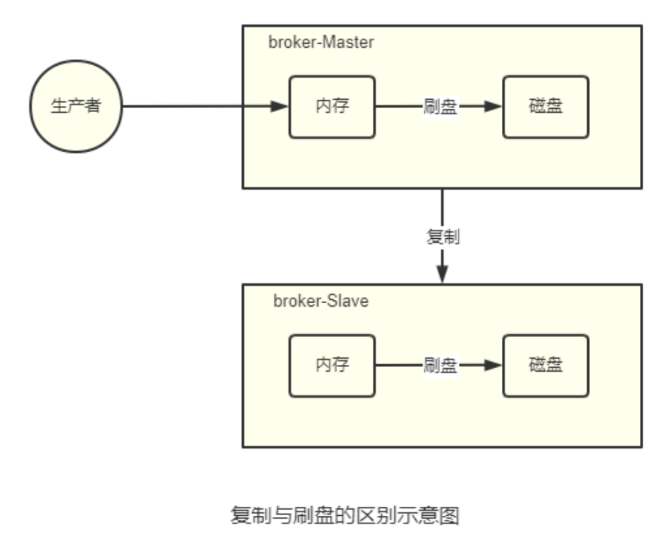

          复制策略
          复制策略是Broker的Master与Slave间的数据同步方式。分为同步复制与异步复制：
          同步复制：消息写入master后，master会等待slave同步数据成功后才向producer返回成功ACK
          异步复制：消息写入master后，master立即向producer返回成功ACK，无需等待slave同步数据成
          功
          异步复制策略会降低系统的写入延迟，RT变小，提高了系统的吞吐量

          刷盘策略
          刷盘策略指的是broker中消息的落盘方式，即消息发送到broker内存后消息持久化到磁盘的方式。分为
          同步刷盘与异步刷盘：
          同步刷盘：当消息持久化到broker的磁盘后才算是消息写入成功。
          异步刷盘：当消息写入到broker的内存后即表示消息写入成功，无需等待消息持久化到磁盘。

          1）异步刷盘策略会降低系统的写入延迟，RT变小，提高了系统的吞吐量
          2）消息写入到Broker的内存，一般是写入到了PageCache
          3）对于异步 刷盘策略，消息会写入到PageCache后立即返回成功ACK。但并不会立即做落盘操作，而是当PageCache到达一定量时会自动进行落盘。

   2. Broker集群模式

              根据Broker集群中各个节点间关系的不同，Broker集群可以分为以下几类：
              1) 单Master
              只有一个broker（其本质上就不能称为集群）。这种方式也只能是在测试时使用，生产环境下不能使
              用，因为存在单点问题。

              2) 多Master
              broker集群仅由多个master构成，不存在Slave。同一Topic的各个Queue会平均分布在各个master节点上。
              优点：配置简单，单个Master宕机或重启维护对应用无影响，在磁盘配置为RAID10时，即使机器
              宕机不可恢复情况下，由于RAID10磁盘非常可靠，消息也不会丢（异步刷盘丢失少量消息，同步刷盘一条不丢），性能最高；
              缺点：单台机器宕机期间，这台机器上未被消费的消息在机器恢复之前不可订阅（不可消费），
              消息实时性会受到影响。
              以上优点的前提是，这些Master都配置了RAID磁盘阵列。如果没有配置，一旦出现某Master宕
              机，则会发生大量消息丢失的情况。 

              3)多Master多Slave模式-异步复制
                broker集群由多个master构成，每个master又配置了多个slave（在配置了RAID磁盘阵列的情况下，一
                个master一般配置一个slave即可）。master与slave的关系是主备关系，即master负责处理消息的读写
                请求，而slave仅负责消息的备份与master宕机后的角色切换。
                异步复制即前面所讲的复制策略中的异步复制策略，即消息写入master成功后，master立即向
                producer返回成功ACK，无需等待slave同步数据成功。
                该模式的最大特点之一是，当master宕机后slave能够自动切换为master。不过由于slave从master的同
                步具有短暂的延迟（毫秒级），所以当master宕机后，这种异步复制方式可能会存在少量消息的丢失问
                题。
                Slave从Master同步的延迟越短，其可能丢失的消息就越少
                对于Master的RAID磁盘阵列，若使用的也是异步复制策略，同样也存在延迟问题，同样也可能
                会丢失消息。但RAID阵列的秘诀是微秒级的（因为是由硬盘支持的），所以其丢失的数据量会
                更少。

#   RocketMQ工作原理

  1. 消息生产

    Producer再将消息写入broker的队列前经历了如下的步骤:
                1) Producer发送消息之前，会先向NameServer发出获取消息Topic的路由信息的请求
                2) NameServer返回该Topic的路由表及Broker列表 
                3)  Producer根据代码中指定的Queue选择策略，从Queue列表中选出一个队列，用于后续存储消息
                4)  Produer对消息做一些特殊处理，例如，消息本身超过4M，则会对其进行压缩
                5)   Producer向选择出的Queue所在的Broker发出RPC请求，将消息发送到选择出的Queue
                路由表: 实际上是一个map key为Topic  value为QueueData  QueueData是broker在该Topic上所有的Queue对应着
                    这个QueueData 其中存放着BrokerName  key为Topic value 为所有涉及到该Topic的Broker的BrokerName列表
                Broker列表: 实际上是一个Map key为BrokerName value为BrokerData BrokerData表示的是 这个BrokerName所对应的Master-Slever集群
                            其中包含 brokerName 和一个map key为 brokerid  value为Broker的地址

  2. Queue选择算法 

             轮询算法
             默认选择算法。该算法保证了每个Queue中可以均匀的获取到消息。
             该算法存在一个问题：由于某些原因，在某些Broker上的Queue可能投递延迟较严重。从而导致
             Producer的缓存队列中出现较大的消息积压，影响消息的投递性能。

            最小投递延迟算法
            该算法会统计每次消息投递的时间延迟，然后根据统计出的结果将消息投递到时间延迟最小的Queue。
            如果延迟相同，则采用轮询算法投递。该算法可以有效提升消息的投递性能。
            
            该算法也存在一个问题：消息在Queue上的分配不均匀。投递延迟小的Queue其可能会存在大量
            的消息。而对该Queue的消费者压力会增大，降低消息的消费能力，可能会导致MQ中消息的堆
            积

# 消息的存储

1. commitlog文件
            

            消息存储在这个文件里面  
            commotlog目录中包含许多mapfield文件 每个文件固定大小1G Broker中的消息都存储在这个文件中，文件名由20位十进制数构成，表示
            当前文件的第一条消息的起始位移偏移量。

            第一个文件名一定是20位0构成的。因为第一个文件的第一条消息的偏移量commitlog offset为0
            当第一个文件放满时，则会自动生成第二个文件继续存放消息。假设第一个文件大小是
            1073741820字节（1G = 1073741824字节），则第二个文件名就是00000000001073741824。
            以此类推，第n个文件名应该是前n-1个文件大小之和。
            一个Broker中所有mappedFile文件的commitlog offset是连续的

            消息单元： mappedFile文件中存储的是一个个的消息单元 
                    每个消息单元中包含消息总长度MsgLen、消息的物理
                    位置physicalOffset、消息体内容Body、消息体长度BodyLength、消息主题Topic、Topic长度
                    TopicLength、消息生产者BornHost、消息发送时间戳BornTimestamp、消息所在的队列QueueId、消
                    息在Queue中存储的偏移量QueueOffset等近20余项消息相关属性。
                    一个mappedFile文件中第m+1个消息单元的commitlog offset偏移量
                    L(m+1) = L(m) + MsgLen(m) (m >= 0)
   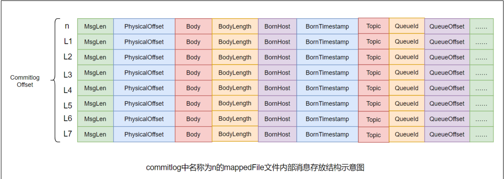

2. consumequeue

   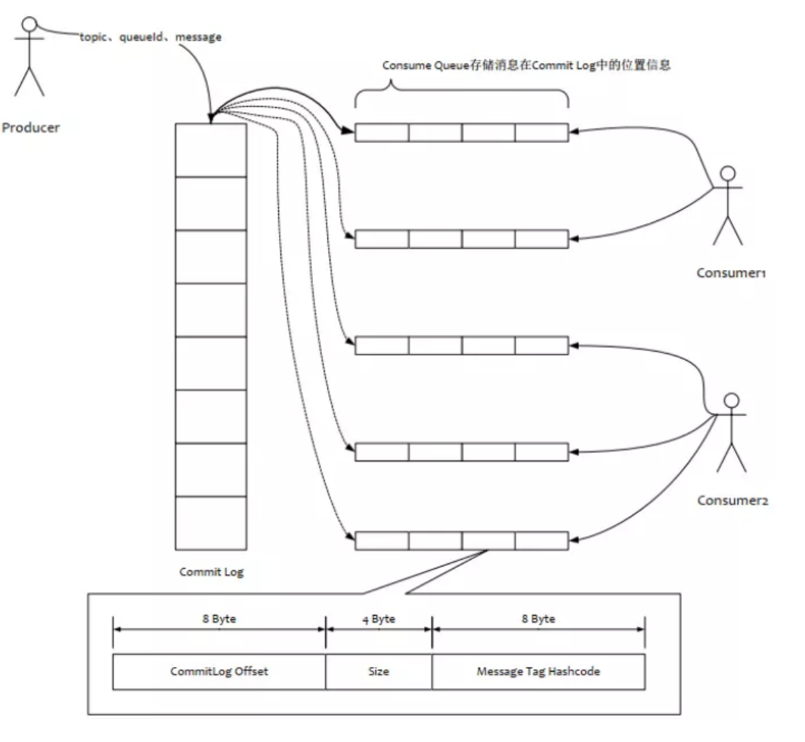

           为了提高效率，会为每个Topic在~/store/consumequeue中创建一个目录，目录名为Topic名称。在该
           Topic目录下，会再为每个该Topic的Queue建立一个目录，目录名为queueId。每个目录中存放着若干
           consumequeue文件，consumequeue文件是commitlog的索引文件，可以根据consumequeue定位到具
           体的消息

            索引条目 : 每个consumequeue文件可以包含30w个索引条目，每个索引条目包含了三个消息重要属性：消息在
                        mappedFile文件中的偏移量CommitLog Offset、消息长度、消息Tag的hashcode值。这三个属性占20
                        个字节，所以每个文件的大小是固定的30w * 20字节
                    
   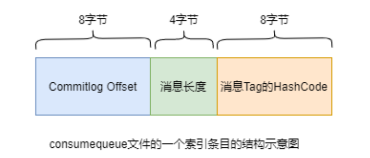

3. 消息写入broker

   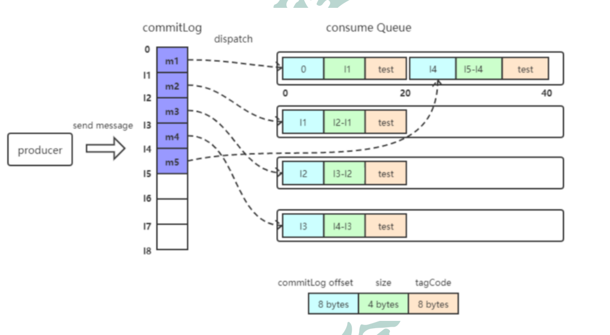
        
        一条消息进入到Broker后经历了以下几个过程才最终被持久化。
        Broker根据queueId，获取到该消息对应索引条目要在consumequeue目录中的写入偏移量，即
        QueueOffset
        将queueId、queueOffset等数据，与消息一起封装为消息单元
        将消息单元写入到commitlog
        同时，形成消息索引条目
        将消息索引条目分发到相应的consumequeue

    
    消息拉取： Consumer获取到要消费的消息所在Queue的消费offset（消费进度），和要消费消息的消息offset（消费第几个消息）
             Broker计算该消息在ConsumeQueue中的Queueoffset   Queueoffset = 20字节*消息offset从该queueOffset处开始向后查找第一个指定Tag的索引条目。
             解析该索引条目的前8个字节，即可定位到该消息在commitlog中的commitlog offset
             从对应commitlog offset中读取消息单元，并发送给Consumer

4. indexFile  

        除了通过通常的指定Topic进行消息消费外，RocketMQ还提供了根据key进行消息查询的功能。该查询
        是通过store目录中的index子目录中的indexFile进行索引实现的快速查询。当然，这个indexFile中的索
        引数据是在包含了key的消息被发送到Broker时写入的。如果消息中没有包含key，则不会写入。

        1.  索引条目结构
                    每个Broker中会包含一组indexFile，每个indexFile都是以一个时间戳命名的（这个indexFile被创建时
                    的时间戳）。每个indexFile文件由三部分构成：indexHeader，slots槽位，indexes索引数据。每个
                    indexFile文件中包含500w个slot槽。而每个slot槽又可能会挂载很多的index索引单元。

   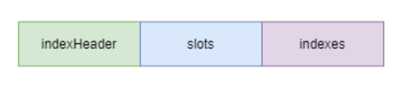

            indexHeader固定40个字节，其中存放着如下数据：
   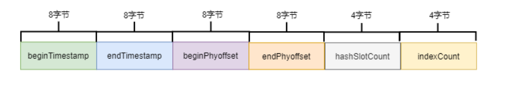

                    beginTimestamp：该indexFile中第一条消息的存储时间
                    endTimestamp：该indexFile中最后一条消息存储时间
                    beginPhyoffset：该indexFile中第一条消息在commitlog中的偏移量commitlog offset
                    endPhyoffset：该indexFile中最后一条消息在commitlog中的偏移量commitlog offset
                    hashSlotCount：已经填充有index的slot数量（并不是每个slot槽下都挂载有index索引单元，这
                    里统计的是所有挂载了index索引单元的slot槽的数量）
                    indexCount：该indexFile中包含的索引单元个数（统计出当前indexFile中所有slot槽下挂载的所
                    有index索引单元的数量之和）

            indexes索引单元与solts的关系：

   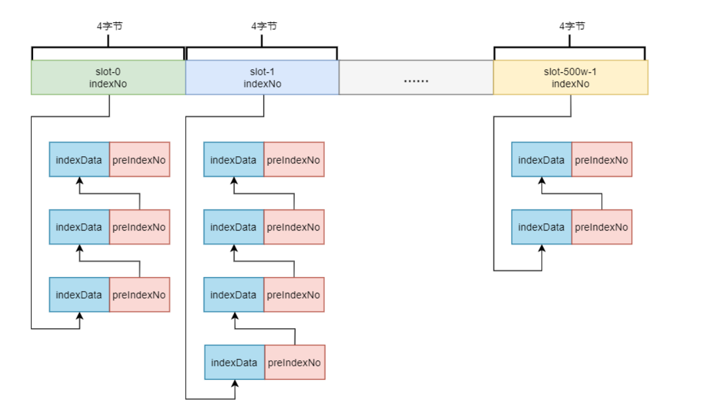

                    key的hash值 % 500w的结果即为slot槽位，然后将该slot值修改为该index索引单元的indexNo，根
                    据这个indexNo可以计算出该index单元在indexFile中的位置。不过，该取模结果的重复率是很高的，
                    为了解决该问题，在每个index索引单元中增加了preIndexNo，用于指定该slot中当前index索引单元的
                    前一个index索引单元。而slot中始终存放的是其下最新的index索引单元的indexNo，这样的话，只要
                    找到了slot就可以找到其最新的index索引单元，而通过这个index索引单元就可以找到其之前的所有
                    index索引单元。

                    index索引单元默写20个字节，其中存放着以下四个属性：

   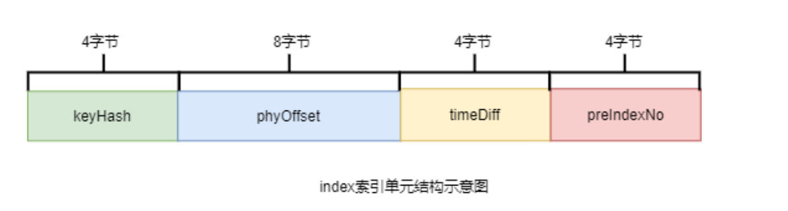

                    keyHash：消息中指定的业务key的hash值
                    phyOffset：当前key对应的消息在commitlog中的偏移量commitlog offset
                    timeDiff：当前key对应消息的存储时间与当前indexFile创建时间的时间差
                    preIndexNo：当前slot下当前index索引单元的前一个index索引单元的indexNo

5. indexFile的创建

                    indexFile的文件名为当前文件被创建时的时间戳。这个时间戳有什么用处呢？
                    根据业务key进行查询时，查询条件除了key之外，还需要指定一个要查询的时间戳，表示要查询不大于
                    该时间戳的最新的消息，即查询指定时间戳之前存储的最新消息。这个时间戳文件名可以简化查询，提
                    高查询效率。具体后面会详细讲解。
                    indexFile文件是何时创建的？其创建的条件（时机）有两个：
                    当第一条带key的消息发送来后，系统发现没有indexFile，此时会创建第一个indexFile文件
                    当一个indexFile中挂载的index索引单元数量超出2000w个时，会创建新的indexFile。当带key的
                    消息发送到来后，系统会找到最新的indexFile，并从其indexHeader的最后4字节中读取到
                    indexCount。若indexCount >= 2000w时，会创建新的indexFile。
                    由于可以推算出，一个indexFile的最大大小是：(40 + 500w * 4 + 2000w * 20)字节
            
            
                    计算指定消息key的slot槽位序号：
                    slot槽位序号 = key的hash % 500w (式子1)
           
                    计算槽位序号为n的slot在indexFile中的起始位置：
                    slot(n)位置 = 40 + (n - 1) * 4 (式子2)

                    计算indexNo为m的index在indexFile中的位置：
                    index(m)位置 = 40 + 500w * 4 + (m - 1) * 20 

            具体查询流程：
    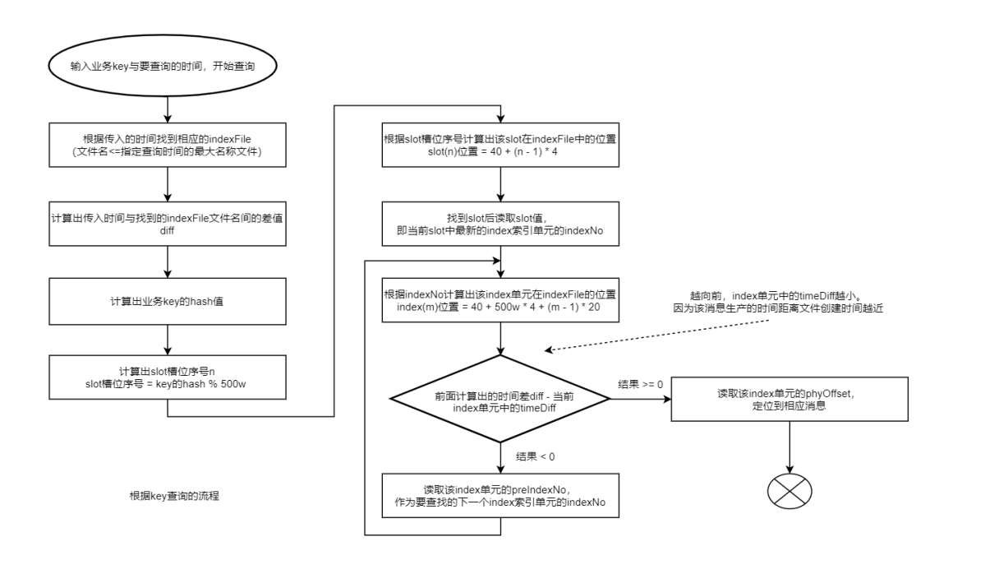
                

   