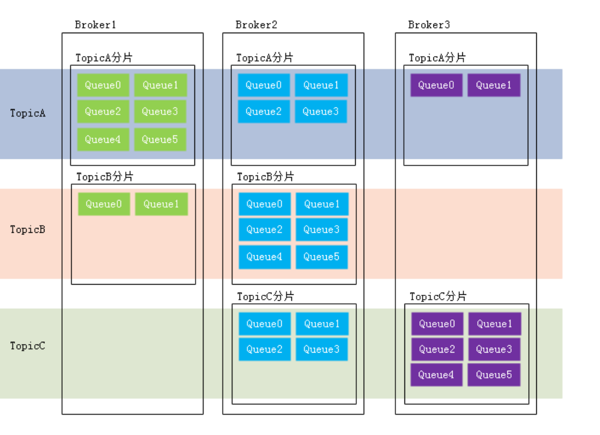
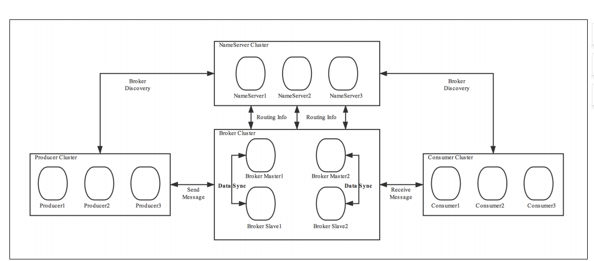
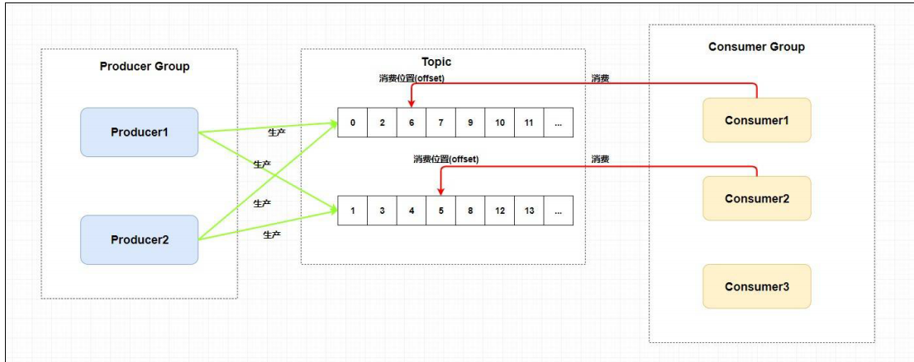
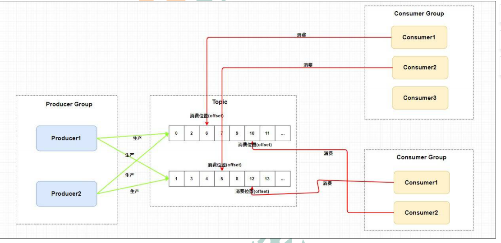

# rocketMq
消息队列rocketmq的学习

# 基本概念

  1. message消息：消息是指系统所传输信息的物理载体,每条消息必须属于一个主题topic

  2. 主题（Topic）： Topic指一系列消息的集合，每个主题包含多个消息，一个消息只能属于一个主题
  一个生产者可以生产多个主题的消息,而一个消费者只可以订阅消费一个主题的消息

  3. 标签（Tag）：为消息所射上的标签，用于同一主题下区分不同类型的消息。来自同一业务单元的消息，可以根据不同业
     务目的在同一主题下设置不同标签。Topic是消息的一级分类，Tag是消息的二级分类

  4. 队列（Queue）：存储消息的物理实体，一个Topic中可以有多个队列，每个Queue中存放的是Topic中的消息，一
     个Topic的Queue也被称为一个Topic中消息的分区（Partition）。一个Topic的queue中的消息只能呗一个消费者组中的
     一个消费者所消费，一个Queue中的消息不允许同一个消费者组中的多个消费者同时消费。

  5. 分片：是指一个Broker在一个Topic中的Queue的集合，存放相应Topic的Broker。每个分片中会创建出相应数量的分区，即Queue，每个
     Queue的大小都是相同的。

  6. 消息标识（MessageId/Key）：RocketMQ中每个消息拥有唯一的MessageId，且可以携带具有业务标识的Key，以方便对消息的查询。
     不过需要注意的是，MessageId有两个：在生产者send()消息时会自动生成一个MessageId（msgId)，
     当消息到达Broker后，Broker也会自动生成一个MessageId(offsetMsgId)。msgId、offsetMsgId与key都
     称为消息标识。
     msgId：由producer端生成，其生成规则为：
     producerIp + 进程pid + MessageClientIDSetter类的ClassLoader的hashCode +
     当前时间 + AutomicInteger自增计数器
     offsetMsgId：由broker端生成，其生成规则为：brokerIp + 物理分区的offset（Queue中的
     偏移量）
     key：由用户指定的业务相关的唯一标识

#  系统架构  
    

  1. Producer：消息生产者，负责生产消息。Producer通过MQ的负载均衡模块选择相应的Broker集群队列进行消息投
     递，投递的过程支持快速失败并且低延迟。
     例如，业务系统产生的日志写入到MQ的过程，就是消息生产的过程
     再如，电商平台中用户提交的秒杀请求写入到MQ的过程，就是消息生产的过程
     RocketMQ中的消息生产者都是以生产者组（Producer Group）的形式出现的。生产者组是同一类生产
     者的集合，这类Producer发送相同Topic类型的消息。一个生产者组可以同时发送多个主题的消息。

  2. Consumer: 消息消费者，负责消费消息。一个消息消费者会从Broker服务器中获取到消息，并对消息进行相关业务
     处理。
     RocketMq中的消费者是以消费者组的形式存在的，一个消费者组中的消费者消费同一类型（Topic）的消息，消费者组实现了'负载均衡'，
     是针对消费者做负载均衡，将一个Topic中的Queue平均分配给消费者组中的不同的消费者，实现了高容错当一个消费者挂掉后会由其他的消费者接着原Consumer
     所消费的Queue去接着消费。
     
     消费者组中Consumer的数量应该小于等于订阅Topic的Queue数量。如果超出Queue数量，则多出的
     Consumer将不能消费消息。 
     
     不过，一个Topic类型的消息可以被多个消费者组同时消费。
     注意，
     1）消费者组只能消费一个Topic的消息，不能同时消费多个Topic消息
     2）一个消费者组中的消费者必须订阅完全相同的Topic

  3.  Name Server：是一个Broker与Topic路由的注册中心，支持Broker的动态注册与发现
      主要包括两个功能：

               1.Broker的管理：接受Broker集群的注册信息并且保存下来作为路由信息的基本数据；提供心跳检测机制，检查Broker是否还存活

               2. 路由信息管理：每个NameServer中都保存着Broker集群的整个路由信息和用于客户端查询的队列信息。
                    Producer和Conumser通过NameServer可以获取整个Broker集群的路由信息，从而进行消息的投递和消费。

               3. 路由注册
                     NameServer通常也是以集群的方式部署，不过，NameServer是无状态的，即NameServer集群中的各
                     个节点间是无差异的，各节点间相互不进行信息通讯。那各节点中的数据是如何进行数据同步的呢？在
                     Broker节点启动时，轮询NameServer列表，与每个NameServer节点建立长连接，发起注册请求。在
                     NameServer内部维护着⼀个Broker列表，用来动态存储Broker的信息。
                     注意，这是与其它像zk、Eureka、Nacos等注册中心不同的地方。
                     这种NameServer的无状态方式，有什么优缺点：
                     优点：NameServer集群搭建简单，扩容简单。
                     缺点：对于Broker，必须明确指出所有NameServer地址。否则未指出的将不会去注册。也正因
                     为如此，NameServer并不能随便扩容。因为，若Broker不重新配置，新增的NameServer对于
                     Broker来说是不可见的，其不会向这个NameServer进行注册
                      Broker节点为了证明自己是活着的，为了维护与NameServer间的长连接，会将最新的信息以心跳包的
                      方式上报给NameServer，每30秒发送一次心跳。心跳包中包含 BrokerId、Broker地址(IP+Port)、
                      Broker名称、Broker所属集群名称等等。NameServer在接收到心跳包后，会更新心跳时间戳，记录这
                      个Broker的最新存活时间。

               4. 路由剔除：由于Broker关机、宕机或网络抖动等原因，NameServer没有收到Broker的心跳，NameServer可能会将
                      其从Broker列表中剔除。
                      NameServer中有⼀个定时任务，每隔10秒就会扫描⼀次Broker表，查看每一个Broker的最新心跳时间
                      戳距离当前时间是否超过120秒，如果超过，则会判定Broker失效，然后将其从Broker列表中剔除。

                      扩展：对于RocketMQ日常运维工作，例如Broker升级，需要停掉Broker的工作。OP需要怎么
                      做？
                      OP需要将Broker的读写权限禁掉。一旦client(Consumer或Producer)向broker发送请求，都会收
                      到broker的NO_PERMISSION响应，然后client会进行对其它Broker的重试。
                      当OP观察到这个Broker没有流量后，再关闭它，实现Broker从NameServer的移除。
                      OP：运维工程师
                      SRE：Site Reliability Engineer，现场可靠性工程师
               

               5. 路由发现： RocketMQ的路由发现采用的是Pull模型。当Topic路由信息出现变化时，NameServer不会主动推送给
                            客户端，而是客户端定时拉取主题最新的路由。默认客户端每30秒会拉取一次最新的路由。

                    扩展：
                    1）Push模型：推送模型。其实时性较好，是一个“发布-订阅”模型，需要维护一个长连接。而
                    长连接的维护是需要资源成本的。该模型适合于的场景：
                    实时性要求较高
                    Client数量不多，Server数据变化较频繁
                    2）Pull模型：拉取模型。存在的问题是，实时性较差。
                    3）Long Polling模型：长轮询模型。其是对Push与Pull模型的整合，充分利用了这两种模型的优
                    势，屏蔽了它们的劣势。